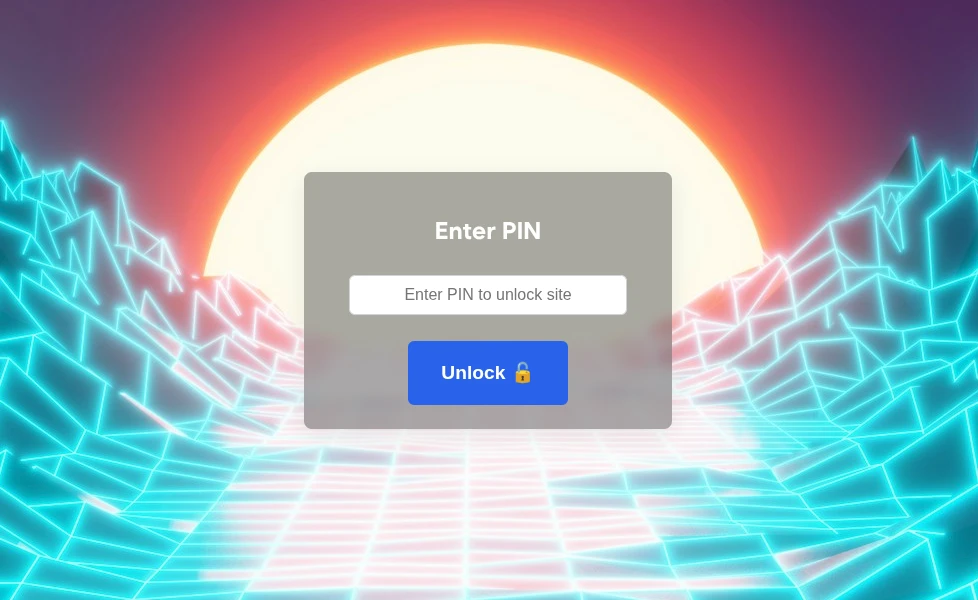

# Gatekeeper

Gatekeeper is a an *ultra simplistic* tool to secure your websites behind a pin/password, thus making their content inaccessable to malicious actors, search engine or AI bot, or straight out randoms.

## Why?

Sometimes we are working on something new, and would like to see our site up-online. However we may not yet be ready to publicly share our work.

Gatekeeper allows us to see our site as if it were in "production" under our own domain. Now we can share our idea safely with friends and co-workers, for instance to share mock-up designs etc.

## How does it work?

Upon first visiting your site a visitor will be redirected to a subpage `/pin-challenge`. They'll be asked for a password and once provided, will be redirected back to the root domain — now accessable freely.

A successful verification will be stored as a client side cookie in the browser.

## Usage & Structure

Put your website files inside the `/protected` folder.

The `/public` folder holds the frontend for Gatekeeper itself, the backend code is within `server.js`. You can adjust the background wallpaper by replacing it under `public/assets/bg.jpg` (keep the same name or modify the css code inside `public/pin-challenge/index.html` to account for it).

### Setting a secure PIN/Password

Define a plain text pin inside the `pin.txt` file. On first run, Gatekeeper will convert it to a secure ([scrypt](https://en.wikipedia.org/wiki/Scrypt) derived) hash (`pin.txt` -> `pin.hash`). So write down or remember your pin.

Alternatively, if you want set your pin or update it manually, you can run `node set-pin.js`. You'll be prompted for the new pin to be hashed and a `pin.hash` file will be generated for you.

### Running the server

.... is as simple as `npm start`.

## How Secure is it?

Secure enough to keep general bot scrapers, search engines and overly curious rando's out of the way.

Secure enough against a stubborn malicious actor?

Mostly, that depends mostly on your password strength.

However I am not a security researcher and haven't properly audited the tool. But for my use-case it is more than enough.

## Contributions

High quality contributions are highly encouraged!
Feel free to post bug reports or send in pull request.

Stuff not yet implemented:
 - Protection against bruteforcing passwords (maybe just a timeout is enough)
 - HMAC key rotation?
 - reviewing security aspects
 - probably other stuff I've missed
